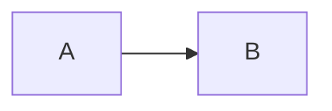

# Spote usage skill

Spote is a persistent Markdown notebook intended for durable human and agent knowledge.

## Before creating notes

Search Spote when the user refers to existing knowledge, projects, decisions, instructions, or previous notes.

Avoid creating duplicate notes. Prefer updating an existing note when it represents the same subject.

## Creating notes

Use descriptive titles.

Put notes in the most relevant existing bucket. Use Inbox when no clear bucket exists.

Use Markdown structure for longer notes:
- headings
- lists
- tables
- code blocks
- Mermaid diagrams when relationships or processes benefit from visualization

## Tags

Tags are created using inline #hashtags.

Use a small number of meaningful tags rather than many generic tags.

## Mermaid

Use fenced Mermaid blocks:

Prefer Mermaid for:
- architecture
- workflows
- sequences
- dependencies
- state transitions
- timelines

## Linking

Use `relate_notes` when two notes have a durable semantic relationship.

## Principle

Store durable knowledge in Spote. Avoid storing temporary scratch notes or short-lived conversation state.

#spote #skill #agent-memory
